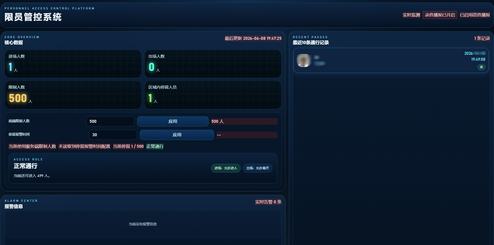

# 人员计数

基于海康门禁 SDK 的人员进出监控与看板系统。后端采集门禁事件并对外提供 HTTP API，前端 Vue 看板实时展示在场人数、进出记录、报警与异常信息。

## 门禁设备

  

## 效果图

 

## 项目结构

```
├── backend/                 # 后端（C# / .NET）
│   ├── config/              # 本地配置（*.json 不纳入 Git，见 *.example 模板）
│   ├── scripts/             # 运维脚本（如从设备同步员工配置）
│   ├── ACSEventConsole.sln  # 解决方案入口
│   └── GetACSEvent/
│       ├── ACSEventConsole.csproj   # 控制台服务（推荐）
│       ├── GetACSEvent.csproj       # 带界面的 SDK 示例程序
│       ├── 启动服务.bat             # 先同步员工再启动后端
│       └── bin/Debug/net8.0/            # dotnet 编译输出目录
└── frontend/                # 前端看板（Vue 3 + Vite + TypeScript）
    ├── src/
    └── dist/                # 生产构建产物
```

## 环境要求

| 组件       | 要求                                                |
| ---------- | --------------------------------------------------- |
| 操作系统   | Windows x64                                         |
| 后端运行时 | .NET 8                                              |
| 后端 SDK   | .NET SDK 8+                                         |
| 前端运行时 | Node.js 18+（推荐 20+）                             |
| 包管理器   | Yarn 1.x                                            |
| Python     | 3.8+（可选，用于从设备同步 `EmployeeConfig.json`）  |
| 网络       | 能访问门禁设备 IP；如需 MQTT 功能需连接 MQTT Broker |

## 快速开始（开发模式）

### 1. 准备配置并同步员工（推荐）

首次运行前，从模板复制配置文件并按实际环境修改：

```bash
cp backend/config/DeviceConfig.json.example backend/config/DeviceConfig.json
cp backend/config/EmployeeConfig.json.example backend/config/EmployeeConfig.json
```

编辑 `DeviceConfig.json` 填入门禁设备 IP、账号、密码后，从设备拉取人员列表写入 `EmployeeConfig.json`：

```bash
cd backend/scripts
python sync_employee_config.py
```

或在 Windows 下双击 `backend/scripts/同步员工配置.bat`。

也可使用一键启动（先同步员工，再启动后端）：

```bash
cd backend/GetACSEvent
启动服务.bat
```

### 2. 启动后端

```bash
cd backend/GetACSEvent
dotnet run --project ACSEventConsole.csproj
```

启动成功后，后端默认监听 **8081** 端口。可通过浏览器访问健康检查接口验证：

```
http://localhost:8081/health
```

### 3. 启动前端

新开一个终端：

```bash
cd frontend
yarn
yarn dev
```

浏览器打开 **http://localhost:5173** 即可查看看板。

Vite 开发服务器会将 `/api`、`/events`、`/images`、`/config`、`/health` 等请求代理到 `http://localhost:8081`，`.env.local` 中 `VITE_API_BASE_URL` 留空即可。

### 4. 生产部署（可选）

```bash
# 构建前端静态资源
cd frontend
yarn build

# 预览构建结果
yarn preview
```

后端保持运行 `ACSEventConsole.exe`；前端可将 `frontend/dist/` 部署到任意静态文件服务器，并通过环境变量指定 API 地址（见下文）。

## 运行顺序

1. （推荐）运行 `backend/scripts/sync_employee_config.py` 从设备同步员工
2. 启动后端 `dotnet run --project ACSEventConsole.csproj`（或使用 `backend/GetACSEvent/启动服务.bat` 自动完成第 1、2 步）
3. 启动前端 `yarn dev`
4. 打开浏览器访问 http://localhost:5173

## 配置说明

配置文件位于 `backend/config/` 目录。修改后需**重启后端**生效。

| 文件                          | 是否纳入 Git          | 说明                                           |
| ----------------------------- | --------------------- | ---------------------------------------------- |
| `DeviceConfig.json`           | 否（见 `.gitignore`） | 门禁设备、Web 端口、限员与 MQTT 等，含设备密码 |
| `EmployeeConfig.json`         | 否（见 `.gitignore`） | 本地员工档案；可用脚本从设备同步生成         |
| `DeviceConfig.json.example`   | 是                    | 设备配置模板                                   |
| `EmployeeConfig.json.example` | 是                    | 员工配置模板                                   |

首次部署，从模板复制并编辑：

```bash
cp backend/config/DeviceConfig.json.example backend/config/DeviceConfig.json
cp backend/config/EmployeeConfig.json.example backend/config/EmployeeConfig.json
```

`DeviceConfig.json` 也可通过 Web 接口在线查看/编辑；`EmployeeConfig.json` 可通过同步脚本自动生成，手动修改后需重启后端：

- `GET /config` — 查看当前设备配置
- `GET /config/edit` — 在线编辑设备配置

---

### DeviceConfig.json

门禁与系统运行参数，顶层分为 `config`（全局）和 `devices`（设备列表）。

> 该文件已加入 `.gitignore`，不会提交到仓库。含设备密码、MQTT 凭证等敏感信息，请在各环境自行维护。

#### config — 全局参数

| 字段                                        | 类型            | 默认值            | 说明                                      |
| ------------------------------------------- | --------------- | ----------------- | ----------------------------------------- |
| `apiBaseUrl`                                | string          | —                 | 预留外部 API 根地址（当前未用于员工同步） |
| `webPort`                                   | number          | `8081`            | 后端 Web 服务端口                         |
| `limitCount`                                | number          | `500`             | 区域限制人数上限                          |
| `stayWarningMinutes`                        | number          | `30`              | 停留超时报警（分钟）                      |
| `recentRecordCount`                         | number          | `10`              | 看板最近进出记录条数                      |
| `exitGraceSeconds`                          | number          | `8`               | 出门宽限时间（秒）                        |
| `capacityWarningRatio`                      | number          | `0.9`             | 人数接近上限时的预警比例（0–1）           |
| `alarmScanSeconds`                          | number          | `5`               | 报警扫描间隔（秒）                        |
| `mqttEnabled`                               | boolean         | `true`            | 是否启用门禁事件 MQTT                     |
| `mqttHost` / `mqttPort`                     | string / number | —                 | MQTT Broker 地址与端口                    |
| `mqttTopic`                                 | string          | `acs/alarm/event` | 门禁事件主题                              |
| `mqttClientId`                              | string          | —                 | MQTT 客户端 ID                            |
| `mqttUsername` / `mqttPassword`             | string          | —                 | MQTT 认证（可选）                         |
| `personInfoMqttEnabled`                     | boolean         | `true`            | 是否发布刷脸信息                          |
| `personInfoMqttHost` / `personInfoMqttPort` | string / number | —                 | 刷脸 MQTT 地址                            |
| `personInfoMqttTopic`                       | string          | `personinfo`      | 刷脸默认主题                              |
| `personInMqttTopic`                         | string          | `person_in`       | 进门事件主题                              |
| `personOutMqttTopic`                        | string          | `person_out`      | 出门事件主题                              |
| `areaAlertMqttEnabled`                      | boolean         | `true`            | 是否订阅区域报警                          |
| `areaAlertMqttTopic`                        | string          | `area_alert`      | 区域报警主题                              |
| `abnormalMqttEnabled`                       | boolean         | `true`            | 是否订阅异常消息                          |
| `abnormalMqttTopic`                         | string          | `abnormal`        | 异常消息主题                              |
| `peopleCountMqttEnabled`                    | boolean         | `true`            | 是否订阅人数统计                          |
| `peopleCountMqttTopic`                      | string          | `people_count`    | 人数统计主题                              |

各 MQTT 块均包含对应的 `*ClientId` 字段，用于区分客户端连接。

#### devices — 门禁设备

`devices` 为数组，每项代表一台门禁设备：

| 字段            | 类型    | 必填 | 说明                                        |
| --------------- | ------- | ---- | ------------------------------------------- |
| `ip`            | string  | 是   | 设备 IP                                     |
| `userName`      | string  | 是   | 登录用户名                                  |
| `password`      | string  | 是   | 登录密码                                    |
| `port`          | number  | 是   | **SDK 端口**，后端 C# 登录设备用，通常为 `8000` |
| `httpPort`      | number  | —    | **ISAPI/HTTP 端口**，员工同步脚本用，默认 `80`  |
| `enabled`       | boolean | 是   | 是否启用该设备                              |
| `name`          | string  | —    | 设备简称                                    |
| `deviceName`    | string  | —    | 设备显示名称                                |
| `deviceID`      | string  | —    | 设备唯一 ID                                 |
| `areaID`        | string  | —    | 所属区域 ID                                 |
| `remark`        | string  | —    | 备注                                        |
| `direction`     | string  | —    | 默认进出方向：`进` / `出`                   |
| `controlDoorNo` | number  | —    | 门控门号，默认 `1`                          |
| `doors`         | array   | —    | 多门方向配置，项含 `doorNo`、`direction` 等 |

配置示例：

```json
{
  "config": {
    "webPort": 8081,
    "limitCount": 500,
    "stayWarningMinutes": 30,
    "recentRecordCount": 10,
    "exitGraceSeconds": 8,
    "capacityWarningRatio": 0.9,
    "mqttEnabled": true,
    "mqttHost": "192.168.0.12",
    "mqttPort": 1883
  },
  "devices": [
    {
      "ip": "192.168.0.164",
      "userName": "admin",
      "password": "your-password",
      "port": 8000,
      "enabled": true,
      "name": "门禁1",
      "deviceName": "测试门禁164",
      "direction": "进",
      "controlDoorNo": 1,
      "doors": []
    }
  ]
}
```

---

### EmployeeConfig.json

员工信息 JSON **数组**，启动时从本地加载，用于将门禁事件中的工号/卡号映射为姓名、部门等展示字段。

> 该文件已加入 `.gitignore`，不会提交到仓库。请在各环境自行维护，勿将含真实身份证、手机号等敏感信息的文件推送到 Git。

可通过脚本从门禁设备批量拉取人员并自动生成该文件（见下文「从设备同步员工配置」）。

#### 常用字段

| 字段                    | 说明                           |
| ----------------------- | ------------------------------ |
| `employeeId`            | 员工主键，与门禁事件员工号匹配 |
| `employeeNo` / `workNo` | 工号别名，同样参与匹配         |
| `name`                  | 姓名（看板展示）               |
| `card_id`               | 卡号，参与匹配                 |
| `department`            | 部门                           |
| `position`              | 岗位                           |
| `phone`                 | 电话                           |
| `gender`                | 性别                           |
| `status`                | 在职状态                       |
| `type`                  | 人员类型（如内部职工、外协）   |
| `permission`            | 权限/区域                      |
| `remarks`               | 备注                           |

后端会按 `employeeId`、`employeeNo`、`card_id`、`name` 等字段与刷脸事件关联。门禁设备返回的员工号需与表中 `employeeId` 或 `employeeNo` 一致，才能正确显示姓名。

配置示例：

```json
[
  {
    "employeeId": "10001",
    "employeeNo": "10001",
    "name": "张三",
    "card_id": "CARD001",
    "department": "技术部",
    "position": "工程师",
    "status": "在职"
  }
]
```

可通过 `GET /api/employee` 查看当前已加载的员工列表。

---

### 从设备同步员工配置

脚本 `backend/scripts/sync_employee_config.py` 通过海康 ISAPI 接口批量查询设备上全部人员（等价于 SDK 文档中的 `NET_DVR_GetPersonList` 使用场景），写入 `backend/config/EmployeeConfig.json`。

#### 用法

```bash
cd backend/scripts

# 默认读取 backend/config/DeviceConfig.json，输出到 EmployeeConfig.json
python sync_employee_config.py

# 指定配置文件
python sync_employee_config.py --device-config ../config/DeviceConfig.json

# 设备 ISAPI 走 HTTPS（默认 443 端口）
python sync_employee_config.py --https
```

Windows 也可双击 `backend/scripts/同步员工配置.bat`，或使用 `backend/GetACSEvent/启动服务.bat` 在启动后端前自动同步。

#### 端口说明

门禁设备存在两套端口，用途不同：

| 用途 | 默认端口 | 配置字段 | 说明 |
| ---- | -------- | -------- | ---- |
| 后端门禁事件（C# SDK） | `8000` | `devices[].port` | `ACSEventConsole` 登录设备、接收刷脸事件 |
| 员工同步脚本（ISAPI/HTTP） | `80` | `devices[].httpPort`（可选） | 调用 `UserInfo/Search` 拉取人员列表 |

脚本**不会**读取 `port: 8000`，未配置 `httpPort` 时默认访问 `http://设备IP:80`。

若设备 Web/ISAPI 不在 80 端口，在 `DeviceConfig.json` 对应设备下增加：

```json
"httpPort": 443
```

并视情况加上 `--https` 参数。

#### 调用的接口

```
POST http://<设备IP>:<httpPort>/ISAPI/AccessControl/UserInfo/Search?format=json
Content-Type: application/json

{
  "UserInfoSearchCond": {
    "searchID": "<随机ID>",
    "searchResultPosition": 0,
    "maxResults": 30
  }
}
```

脚本会分页循环请求，直到取完所有人员；多台设备的结果按 `employeeId` 去重合并。

#### Digest 认证说明

ISAPI 接口使用 **HTTP Digest 认证**，不是单独申请的密钥，而是设备 Web 登录同一套账号密码（即 `DeviceConfig.json` 中的 `userName` / `password`）。

流程简述：

1. 客户端发送 POST 请求
2. 设备返回 `401`，响应头携带 `realm`、`nonce` 等挑战信息
3. 客户端用 **用户名 + 密码 + 挑战信息** 计算出 Digest 值，放入 `Authorization: Digest ...` 请求头后重试
4. 验证通过后返回人员 JSON

脚本内部通过 Python 的 `HTTPDigestAuthHandler` 自动完成上述握手，**无需手动获取或拼接 Digest 字符串**。

#### 手动验证（curl）

```bash
curl -X POST "http://192.168.0.164/ISAPI/AccessControl/UserInfo/Search?format=json" \
  -u admin:你的密码 \
  -H "Content-Type: application/json" \
  -d "{\"UserInfoSearchCond\":{\"searchID\":\"1\",\"searchResultPosition\":0,\"maxResults\":30}}"
```

`-u admin:密码` 会触发 Digest 认证；curl 会自动处理 401 挑战。

#### 为什么浏览器直接打开 URL 会报错

在浏览器地址栏访问：

```
http://192.168.0.164/ISAPI/AccessControl/UserInfo/Search?format=json
```

等价于发送 **GET** 请求，而该接口要求 **POST + JSON 请求体 + Digest 认证**，因此设备会返回：

```json
{
  "statusCode": 4,
  "statusString": "Invalid Operation",
  "subStatusCode": "methodNotAllowed",
  "errorCode": 1073741828,
  "errorMsg": "methodNotAllowed"
}
```

这表示 **HTTP 方法不允许**（用了 GET 而非 POST），并非接口损坏。请使用脚本或 curl 按 POST 方式调用。

---

### 前端 API 地址

复制环境变量示例文件并按需修改：

```bash
cd frontend
cp .env.example .env.local
```

`.env.local` 示例：

```env
# 留空则开发模式走 Vite 代理；生产环境可填写完整后端地址
VITE_API_BASE_URL=http://192.168.0.29:8081
```

## 直接运行已编译版本（可选）

若无需修改后端代码，可跳过 `dotnet run`，直接运行已有产物：

```bash
cd backend/GetACSEvent/bin/Debug/net8.0
./ACSEventConsole.exe
```

## 主要 API 接口

| 接口                 | 说明                           |
| -------------------- | ------------------------------ |
| `GET /api/dashboard` | 人员看板聚合数据（前端主接口） |
| `GET /events`        | 原始门禁事件列表               |
| `GET /config`        | 当前设备配置                   |
| `GET /config/edit`   | 在线编辑配置                   |
| `GET /images`        | 事件关联图片                   |
| `GET /health`        | 健康检查                       |

默认服务地址：`http://localhost:8081`

更详细的接口说明见 `backend/GetACSEvent/事件API说明.md`。

## 常见问题

**前端页面无数据**

- 确认后端 `ACSEventConsole.exe` 已启动且 `/health` 可访问
- 确认 `DeviceConfig.json` 中门禁设备 IP、账号配置正确，设备网络可达
- 开发模式下确认前端运行在 5173 端口（Vite 代理依赖此端口）

**端口冲突**

- 后端端口：修改 `DeviceConfig.json` 中 `config.webPort`
- 前端端口：修改 `frontend/vite.config.ts` 中 `server.port`

**MQTT 相关功能不可用**

- 检查 `DeviceConfig.json` 的 `config` 中 MQTT 主机地址与端口
- 若暂不需要 MQTT，可将对应 `*MqttEnabled` 设为 `false`

**看板显示工号而非姓名**

- 确认已运行 `backend/scripts/sync_employee_config.py` 生成 `EmployeeConfig.json`
- 确认刷脸事件中的员工号与 `EmployeeConfig.json` 中 `employeeId` / `employeeNo` 一致
- 修改 `EmployeeConfig.json` 后需重启后端

**员工同步脚本失败**

- 确认设备 IP 可达，且 `userName` / `password` 与设备 Web 登录一致
- 员工同步走 ISAPI **HTTP 80**（`httpPort`），不是 SDK 的 `port: 8000`
- 若 ISAPI 在其它端口，在设备配置中设置 `httpPort`，HTTPS 设备加 `--https`

**浏览器访问 ISAPI 返回 `methodNotAllowed`**

- 地址栏访问等价于 GET，该接口需 **POST + JSON + Digest 认证**
- 请使用 `sync_employee_config.py` 或 curl（见上文「从设备同步员工配置」）

## 相关文档

- `backend/README.md` — 后端独立项目说明
- `backend/scripts/sync_employee_config.py` — 从设备同步员工配置脚本
- `backend/GetACSEvent/事件API说明.md` — 事件 API 详细文档
- `backend/GetACSEvent/图片服务器使用说明.md` — 图片服务说明